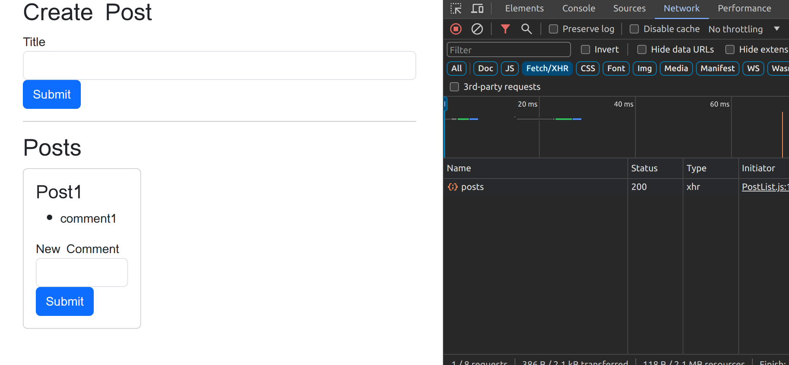
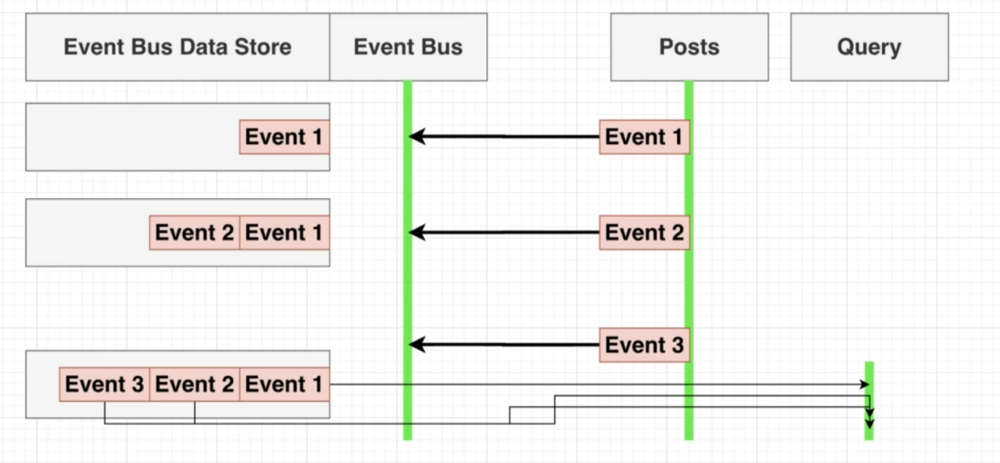

**Project Overview: Microservice Architecture Blog Application**

The project aimed to understand and implement a microservice architecture that could be scaled efficiently. To achieve this, I developed a blog application with several key features, including the ability for users to post blogs, receive comments on their blogs, and have specific comments moderated based on certain keywords.
Components of the Blog Application

The blog application consists of the following components:

    Services:
        Posts Service:
            Manages blog posts.
            Each post consists of a unique ID in hexadecimal format.
            Responsible for handling the creation, update, and retrieval of blog posts.
        Comments Service:
            Manages comments on posts.
            Each comment associated with a post has its unique hexadecimal ID.
            Handles the creation, update, and retrieval of comments associated with blog posts.
        Query Service:
            Fetches data (posts and comments) for the client.
            Aggregates data from posts and comments services to provide a cohesive response to client requests.
        Moderator Service:
            Moderates comments containing the word "orange".
            Updates the status of comments based on moderation results.

    Client:
        Built using React.
        Frontend application where users can interact with the blog.
        Allows users to create posts, view posts, and add comments.
        Displays moderated comments appropriately.

    Event-Bus Service:
        Acts as a communication hub between services.
        Emits and listens for events such as "PostCreated", "CommentCreated", "CommentModerated", etc.
        Ensures services are decoupled and can scale independently.

Workflow Example

    Creating a Post:
        User creates a new post via the client.
        Client sends a request to the Posts Service.
        Posts Service creates a post with a unique hex ID and emits a "PostCreated" event to the Event-Bus.
        Event-Bus broadcasts the "PostCreated" event to relevant services (e.g., Query Service to update its data store).

    Adding a Comment:
        User adds a comment to a post via the client.
        Client sends a request to the Comments Service.
        Comments Service creates a comment with a unique hex ID associated with the post ID and emits a "CommentCreated" event to the Event-Bus.
        Event-Bus broadcasts the "CommentCreated" event to relevant services (e.g., Moderator Service to review the comment, Query Service to update its data store).

    Moderating a Comment:
        Moderator Service receives the "CommentCreated" event.
        Moderator Service checks if the comment contains the word "orange".
        If the comment contains "orange", it updates the comment status and emits a "CommentModerated" event.
        Event-Bus broadcasts the "CommentModerated" event to relevant services (e.g., Query Service to update its data store).

By leveraging a microservice architecture and an event-driven design, the blog application can scale efficiently and handle various tasks asynchronously, ensuring a responsive user experience and maintainable codebase.Enhancing Development Workflow with Docker, Kubernetes, and Skaffold

**
Enhancing Development Workflow with Docker, Kubernetes, and Skaffold:**

To address the challenge of managing multiple services and workflows, Docker, Kubernetes, and Skaffold were employed. These tools streamline development and deployment processes, especially when scaling to a cloud environment.
Challenges and Solutions

    Challenge: Running Multiple Workflows
        Solution: Containerization with Docker
            Docker containerizes each component (posts, comments, query, moderator, client, event-bus), ensuring that each has its own runtime environment.
            Benefit: Consistent environments across different development stages and platforms.
        However, containerization alone does not fully solve the issue of starting multiple services efficiently.

    Challenge: Managing and Orchestrating Multiple Containers
        Solution: Orchestration with Kubernetes
            Kubernetes manages and orchestrates these containers by creating separate pods for each service.
            Deployment Manifests: deploy.yaml files are used to define and deploy the necessary pods and ensure they work together as a cluster.
            Benefit: Scalability and efficient resource management, but the services are isolated and need proper routing for communication.

    Challenge: Service Isolation and Routing Traffic
        Solution: Kubernetes Services for Traffic Routing
            ClusterIP: Used for internal communication between services within the cluster.
            LoadBalancer and Ingress (nginx-ingress): Expose services to the outside world, managing external access and routing traffic to the correct pods.
            Benefit: Services are properly isolated internally while still accessible externally as needed.

    Challenge: Continuous Development and Deployment
        Solution: Skaffold for Continuous Development
            Skaffold: Automates the build, push, and deploy processes, making it easier to manage changes and updates across all services.
            Benefit: Streamlines the development workflow, reducing manual steps and ensuring quick iterations. 

            
