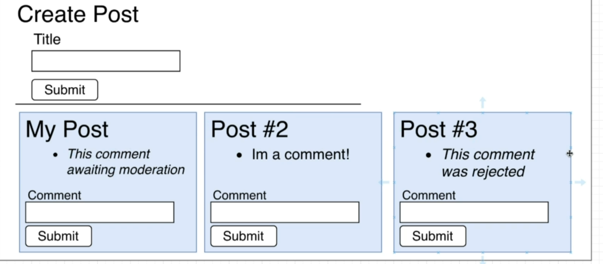
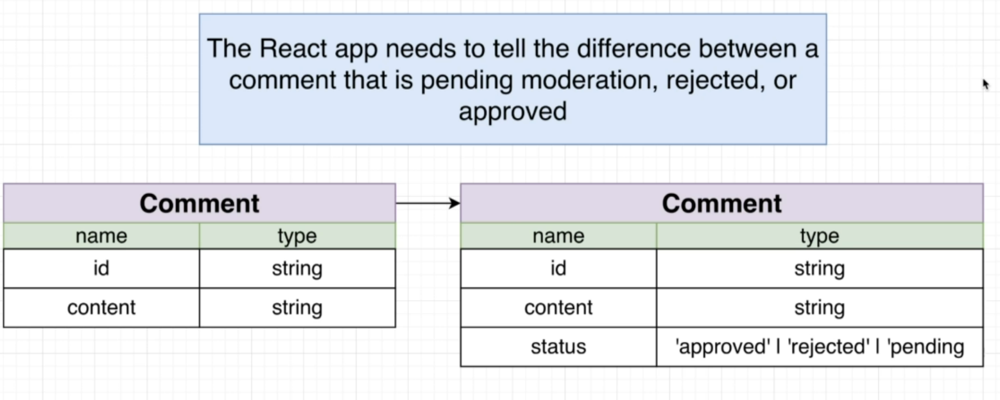
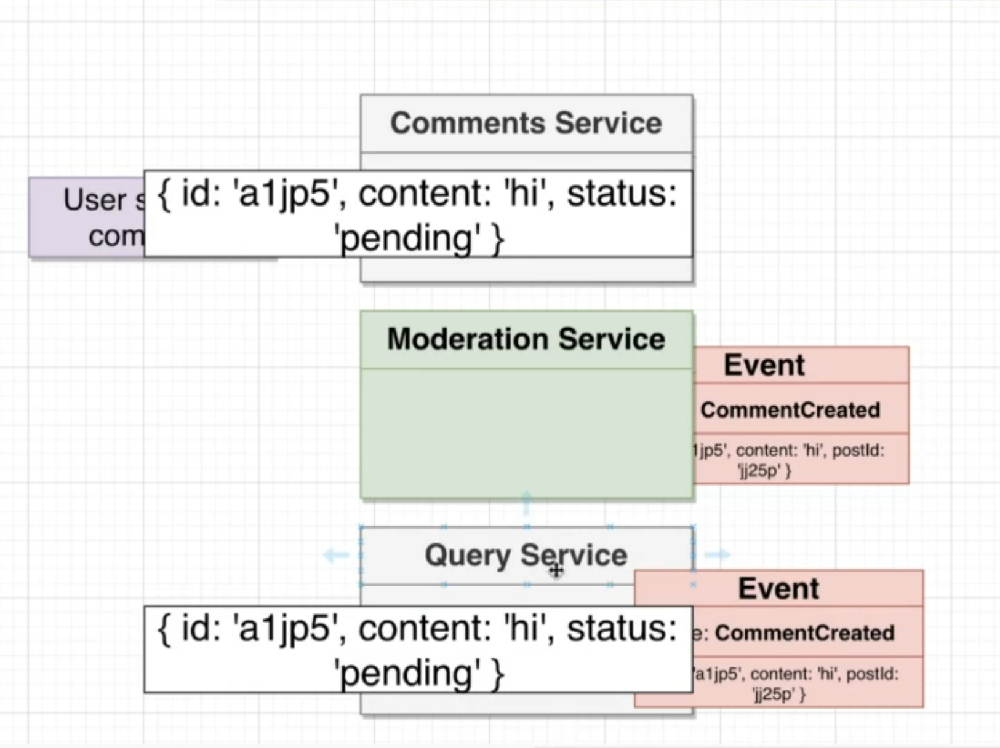
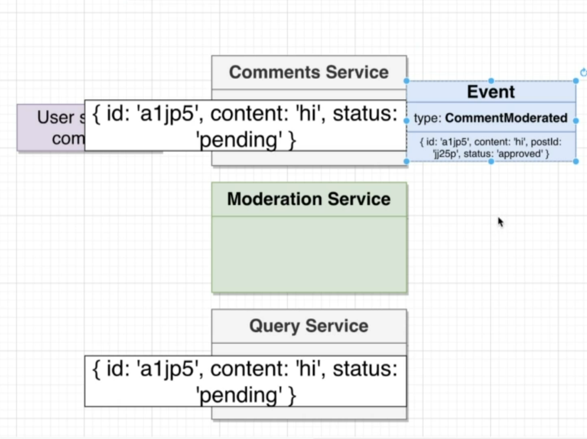
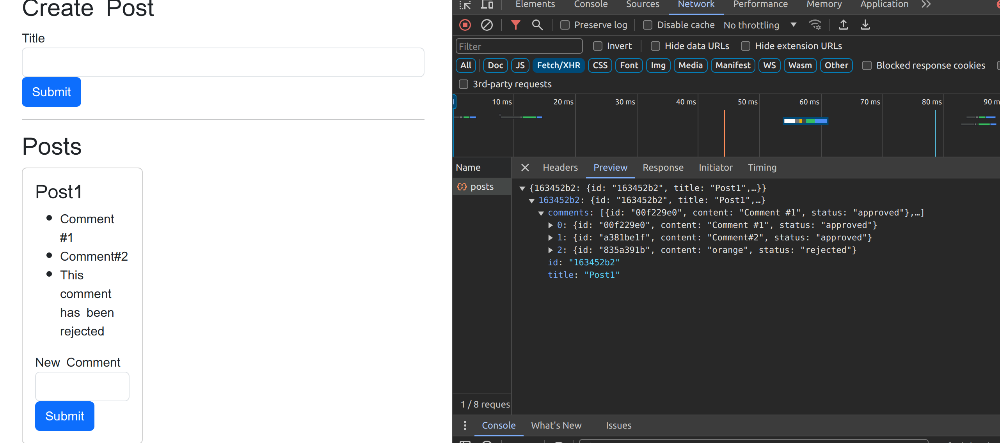

Part 3:

Implementation of a new feature for my tweet Clone App

This feature is to simply check if the content of the service contains the word 'Orange' then rejects the comment and doesnt display the comment else it needs to approve the comment.

While implementing this there can be 3 states the service might face
1. The comment is approved and the contents should be displayed
2. The comment is rejected and the contents should be rejected and a message should be displayed to used that their comment is rejected
3. The comment is in processing stage where we still figuring out if the content has the word orange.
-> This sinario is simple since we are only filtering a word orange and the output of this would be in milliseconds
->The senario in which maybe we use an actual human to filter a comment it may take hours or days to produce output and hence we mayneed to display the user the comment is in await state.

There are 2 approaches I thought to solve this problem.
Option1

By emiting event only for  moderation service when comment service is created and later moderation emmiting event to query service after the moderation.
Problem with this approach is that moderation service may take time or if it down then query service might not operate.

Option2

Adding a status to props which says service status such as pending, aprooved and rejected and sending the events to query ass well moderation service and when the moderation service updates the event sending it back to the query service.

Hence, The output:

Problems:    
Synchronization of events poses challenges, such as when the moderation service experiences downtime. Consequently, events sent for moderation remain in a pending status. Once the moderation service is operational again, it lacks data on previously dispatched events from the event bus.

To address this issue in the upcoming branch, implementing a database within the event bus is necessary. This database would store information on prior comment events, ensuring data continuity and availability even during service outages.

The proposed solution involves integrating a database into the event bus system, allowing the preservation of previously sent events. This ensures that upon the restoration of the moderation service, historical event data remains accessible and can be processed accordingly.
 

