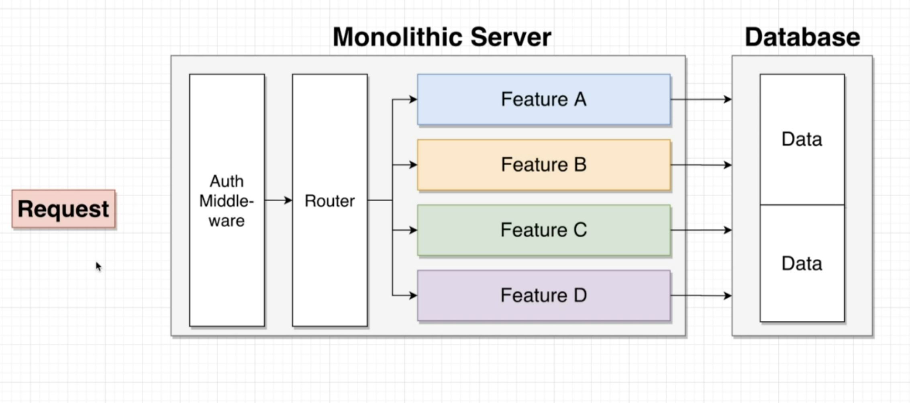
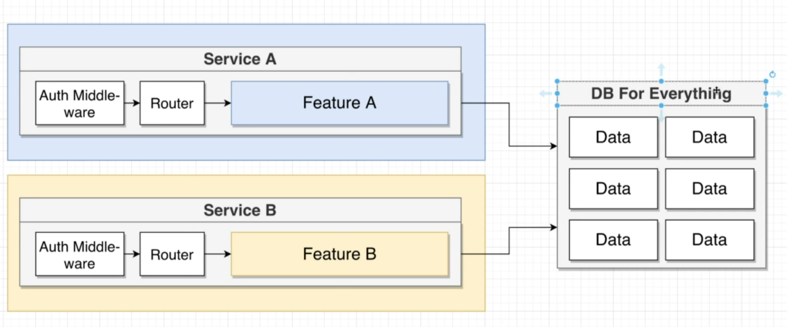
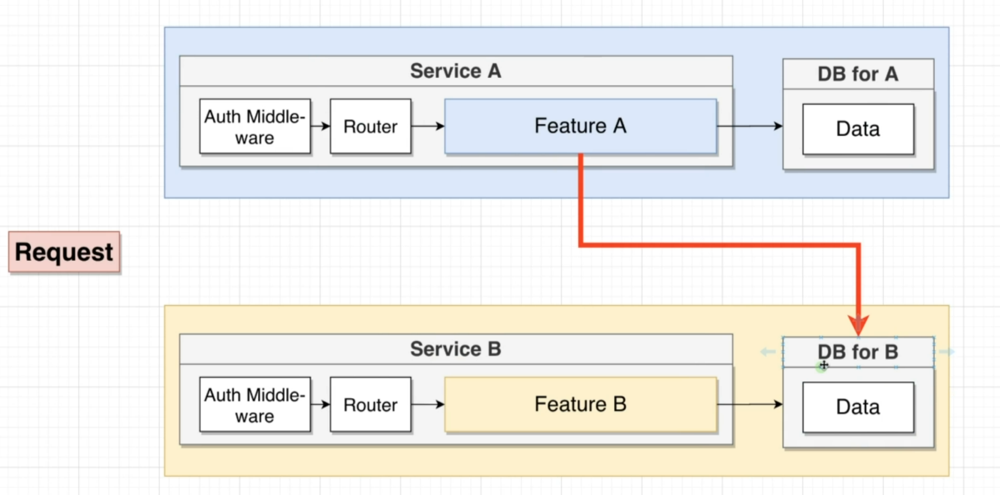
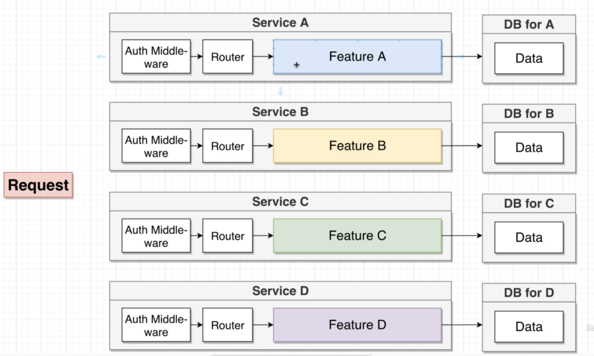
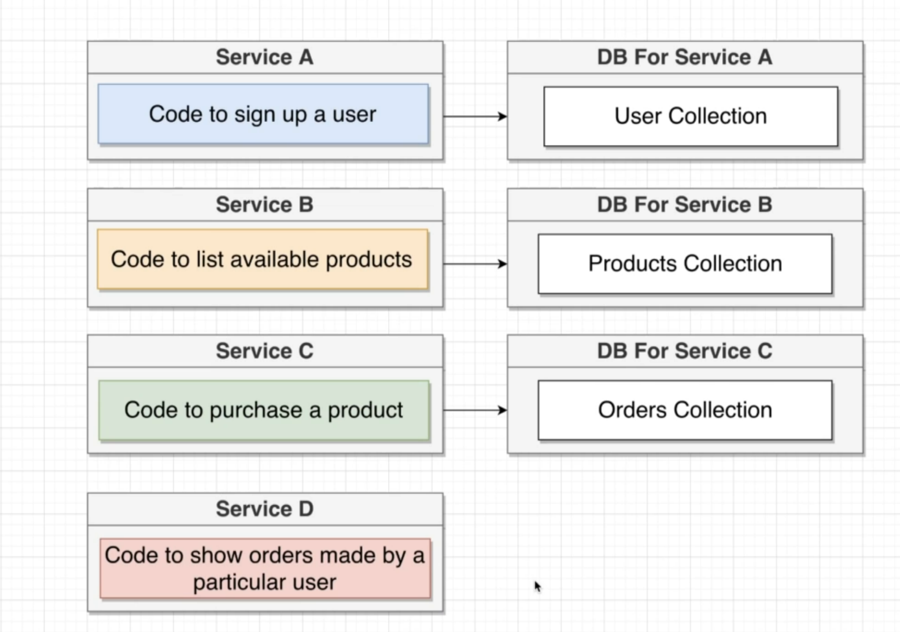

This is a blog/tweetclone application using microservices.

Here I have created 4 microservice namely

1 Post      :   Posts the blog or creates 
2 Comment   :   Comment on the Post that is created, This is specific towards the post
3 Moderation:   Evaluates the comment and doesnt allow the user to comment the word 'Orange' 
4 Query     :   Displays all the post and comments to the user

SKills/tools and Libraries: ReactJS, NodeJS, Axios, ExpressJS, CORS, APIIntegration

Here a note is that I have also created my own event bus api that connects all these services.
If Post stops working, the query service will be still active and you can view the posts and comments of existing items

To run this code you'll need to navigate to branch syncingevent with no discrupency and open different folder and run the command npm start. 

Now My next step is to dockerize the services.

Some Prefix of my understanding of different types of architchure.

This is a Application that I'll create using Microservice Architechure.

Monolithic Architecture is an architectural style for designing software applications where all components of the application are tightly integrated into a single codebase, and they run as a single process. This approach contrasts with a microservices architecture, where the application is broken down into smaller, loosely coupled services that run independently. Here's an explanation of the issues you mentioned in the context of monolithic architecture:

1. Interdependence of Services:
    In a monolithic architecture, all services are tightly integrated. This means that any changes or updates to one part of the application can potentially affect other parts. This interdependence can make it challenging to develop, test, and maintain the application. It may also lead to difficulties in scaling individual components independently.

2.    Single Point of Failure:
    Since all services in a monolithic architecture are typically running in the same process or application, they share the same runtime environment. If one service experiences a failure or goes down, it can potentially impact the entire application. This makes the architecture vulnerable to single points of failure. For example, if a critical service crashes, it can bring down the entire application.

3.     Database Dependency:
    In a monolithic architecture, it's common for all services to share the same database. This can lead to issues when different services have different data storage requirements. For example, one service might need a relational database, while another might require a NoSQL database. Changing the type or schema of the database can result in compatibility issues and unintended consequences for other services. It also makes it challenging to scale and optimize the database for different service needs.

However, it's important to note that monolithic architectures still have their use cases and can be appropriate for simpler applications or when transitioning from legacy systems. The choice of architecture should be based on the specific needs and constraints of the project.

To address these issues, many organizations have moved towards more modular and decoupled architectures, such as microservices or serverless architectures. These architectures aim to break down the application into smaller, independent components that can be developed, deployed, and scaled individually. This can improve fault tolerance, scalability, and flexibility.

Problem: Where we can see that some features need to make use of other feature to implement the changes.
To make these feasiable there are 2 ways.

1. Synchronous Method:

    Features directly communicate with each other in real-time.
    Simplicity and real-time updates are advantages.
    Drawbacks include tight coupling, potential performance bottlenecks, and scalability challenges.

2. Asynchronous Method:

    Events or requests are sent to an event bus or message broker for asynchronous processing.
    Promotes loose coupling, scalability, and fault tolerance.
    Drawbacks include the need for extra storage and increased complexity.

Check My Branches for the stage changes.

