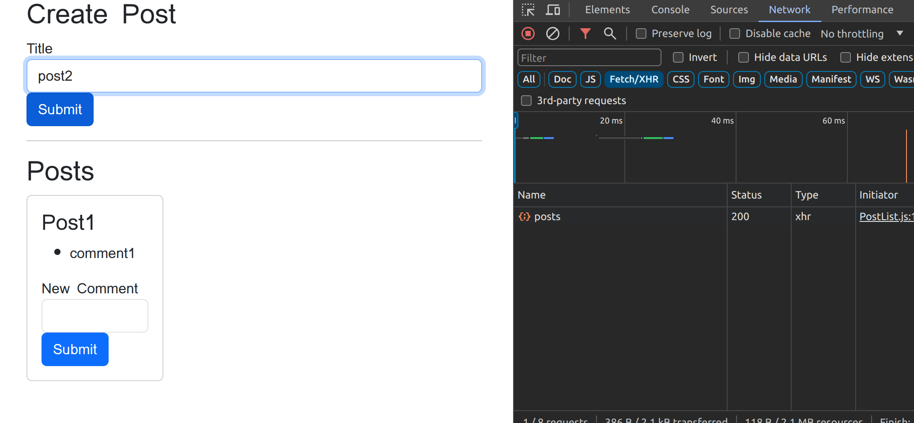
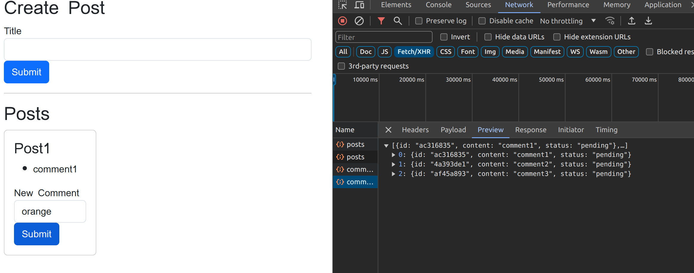
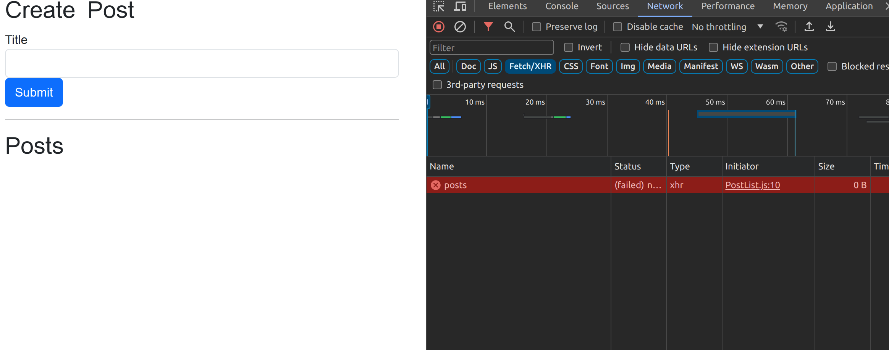
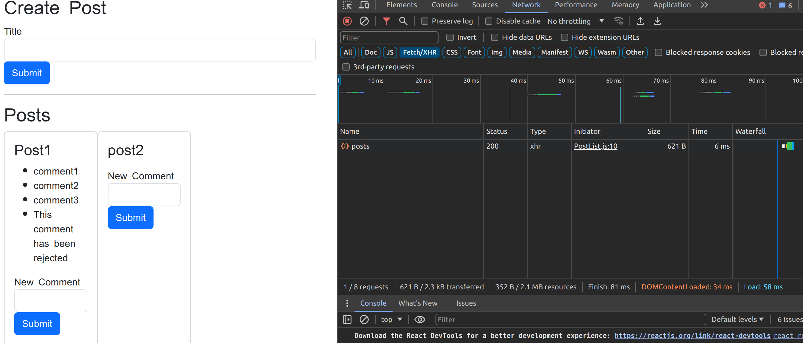
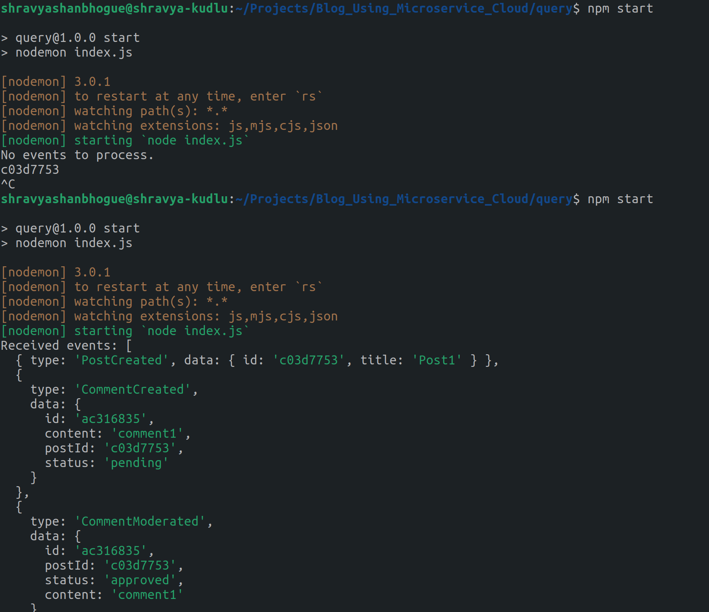

To sync Event

Output:

Creating a new post

Turning of the query service
When I turn of the query service the user is still able to enter the inputs:

Adding Comments:

When we refresh:

Turning the query service back up:

Hence, We achived Sync, This the output from my terminal.

Next is to containerize it by using Docker.

