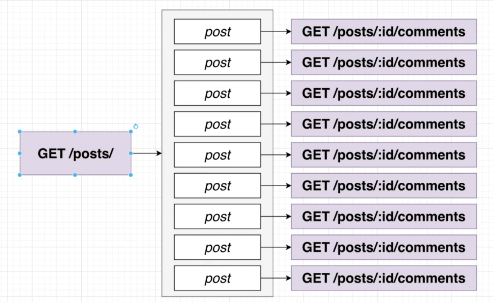
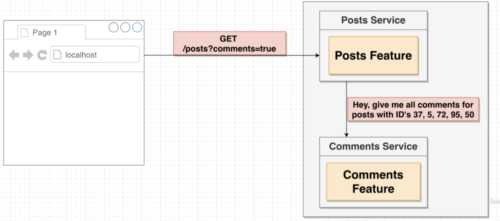
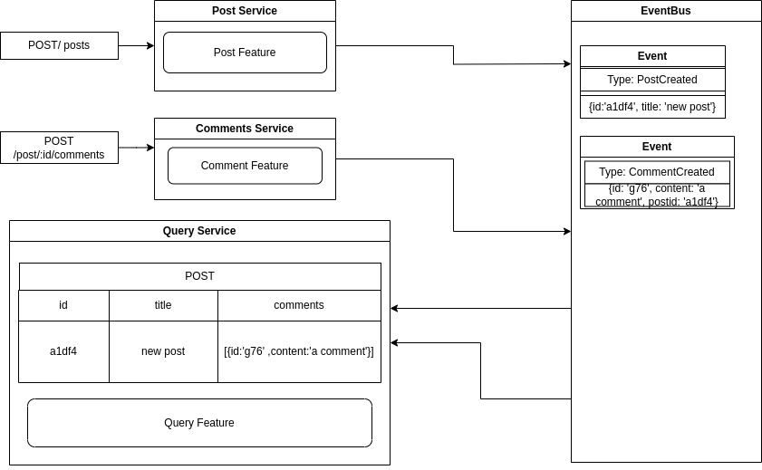
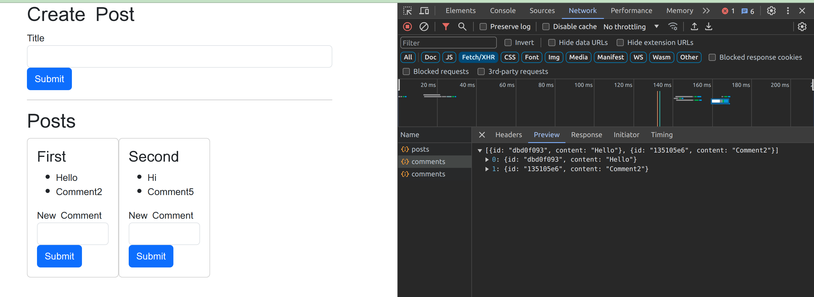
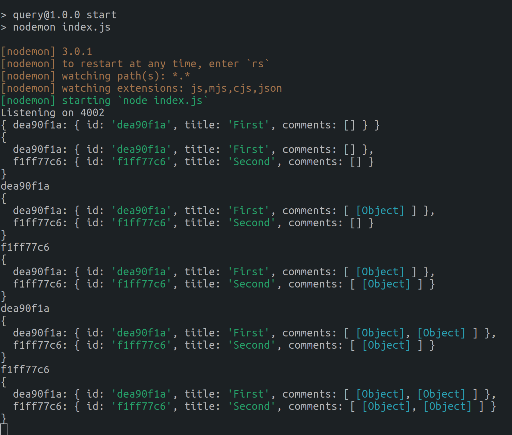

Part2:

Problems: With Stage1:

For Every Post we need seperate call to comments, 
In my case I had 6 post and I ended up repeatedly making 6 request to comment section.

Sol1: Sync Solution 

Downsides -> The entire application depends on 1 service, these services are not mutually exclusive.

Sol2: Addition of EventBus to create a query Service.
Everytime there is an occurance of an event(PostCreate || CommentCreate) it would be shared with the eventBus which would update the query Service.
Hence, the query Service would be super fast.
1 downside is if the eventbus crashes the query service will crash.
 

Different Types of event bus: RabbitMQ, Kafka, NAT which has a lot of functionality with express

Trying to build my own event Bus
Sol:
After Adding Event Bus

QueryAPI

After adding the changes to React
