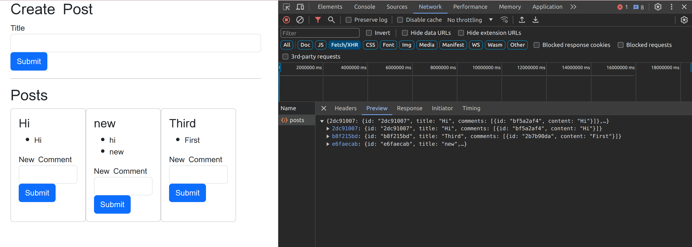

Part2:

Problems: With Stage1:

For Every Post we need seperate call to comments, 
In my case I had 6 post and I ended up repeatedly making 6 request to comment section.

Sol1: Sync Solution 

Downsides -> The entire application depends on 1 service, these services are not mutually exclusive.

Sol2: Addition of EventBus to create a query Service.
Everytime there is an occurance of an event(PostCreate || CommentCreate) it would be shared with the eventBus which would update the query Service.
Hence, the query Service would be super fast.
1 downside is if the eventbus crashes the query service will crash.
 

Different Types of event bus: RabbitMQ, Kafka, NAT which has a lot of functionality with express

Trying to build my own event Bus
Sol:
After Adding Event Bus

QueryAPI

After adding the changes to React change

This seamless operation highlights the strength of microservices in enabling independent functionality. Even with the post service on port 4000 and the comments service on port 4001 offline, the application delivers previous posts and comments to users. The query service's independent data storage and its synchronization via the event bus exemplify the microservices' capability. Continuously updated through events, the query service ensures uninterrupted access to existing data, showcasing the robustness of a microservices architecture. Furthermore, by maintaining separate records and employing the event-driven model, the query service avoids the need for multiple calls to the comment service from the post service every time a new comment is created, streamlining data access and enhancing efficiency within the architecture. 
